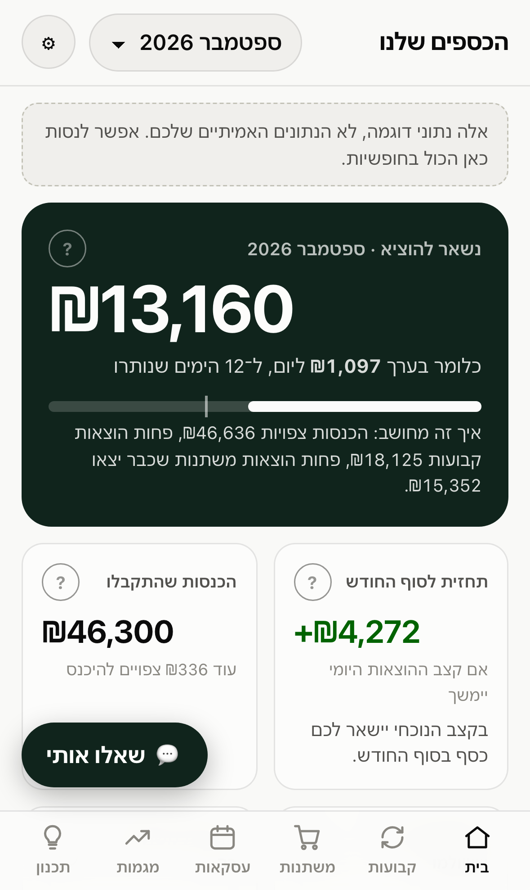
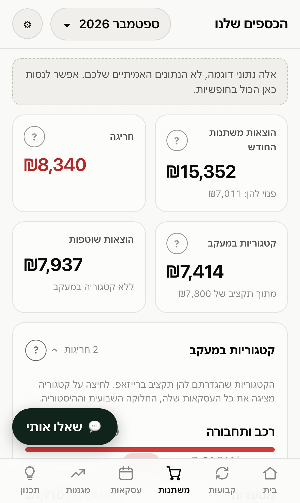
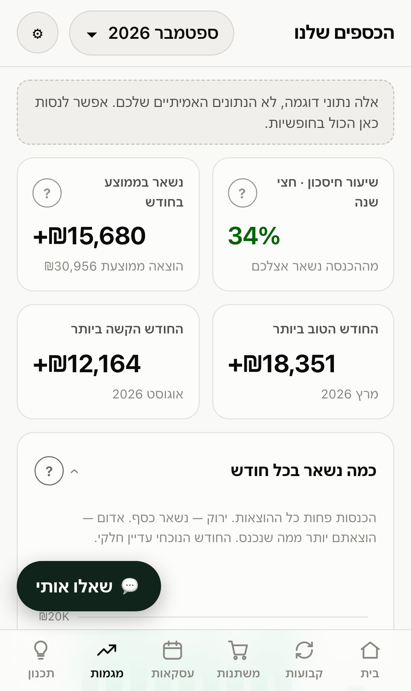
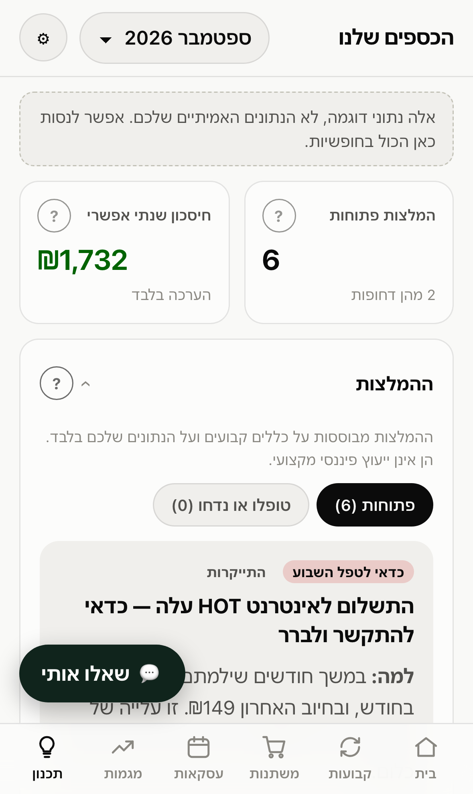

# Family Finance Hub

A private, mobile-first dashboard for one household's money. It pulls your
cashflow from [RiseUp](https://www.riseup.co.il) through RiseUp's official
read-only MCP server, keeps its own copy, and shows it in a Hebrew, right-to-left
UI on your own domain, locked to the two to four people you list.

<p align="center">
  
  
  
  
</p>

<p align="center"><sub>Screenshots show the built-in sample data.</sub></p>

## What you get

- **One number first.** How much is left to spend this month and per day, with
  the arithmetic shown underneath.
- **Fixed and variable kept apart**, exactly as RiseUp files them. Every item
  opens a detail sheet with its history.
- **Plain-language explanations.** Every term has a `?` with a glossary entry.
  Three text sizes, and a table view behind every chart.
- **Your arrangement survives.** Renames, categories, hidden items and widget
  layout live in an overrides layer. A sync never overwrites them, and nothing
  is ever deleted.
- **Recommendations** from fixed rules over your own data: a bill that crept up,
  loans worth consolidating, a subscription nobody uses.
- **What is really free.** Some "variable" categories are fixed in all but name:
  groceries, the pharmacy. Commit to a monthly amount for one and it becomes that
  category's budget in the hub, set aside next to the fixed charges, so the last
  line shows what is left for everything else.
- **Pending fixed charges get a name.** RiseUp's API names a fixed charge only
  once it has been charged. Until then the hub infers it from recent months by
  amount and expected day, says when it is unsure, and flags a charge that has
  been expected for months and never came.
- **Next month, predicted.** Expected income, fixed charges (and which
  installment plans end), and variable spending per category against its budget.
- **"Can I buy this?"** Ask before spending. The assistant says which budget it
  comes out of and what is left. If that budget is short, it offers to move money
  from a category that is under budget, and does it only after you approve. If
  nothing has room, it says so: only if it really matters. Shifts live in the
  hub, are never deleted, and RiseUp itself is not changed.
- **What-if planner.** A bonus, a raise, a new loan: see the months ahead and a
  safe daily spend.
- **Ask in Hebrew** (optional). An assistant on Claude that answers only through
  tools over the same dashboard data.

## How it works

```
RiseUp ──(official MCP server, token scope budget:read)──> sync Lambda, twice a day
                                                                │
                                                                ▼
                                                        S3, one JSON per month
                                                                │
phone ──> Cloudflare Access ──> Cloudflare Pages ──/api──> API Lambda
          (email allowlist)     (UI + proxy function)       verifies the Access JWT
```

The RiseUp token lives only in SSM; CI can write it and cannot read it back.
The API checks the Access token and the email allowlist itself, so the gate does
not depend on Cloudflare alone. Everything is serverless, and a budget alarm
is set at $5 a month.
The reasoning is in [docs/architecture.md](docs/architecture.md).

## Try it in two minutes

```bash
npm install
npm run dev      # http://localhost:5180, on sample data
npm test
```

No accounts needed. To see your own data locally, without any cloud, put a
RiseUp token in `.env` and follow "Local development" in
[docs/setup.md](docs/setup.md).

## Deploy your own

You need an AWS account, a domain on Cloudflare, and a RiseUp account.

1. `cp .env.example .env` and fill it in. In each stack under `infra/`, copy
   `example.tfvars` to `terraform.tfvars` (gitignored) and fill it in.
2. `scripts/bootstrap-state.sh`, then apply `infra/bootstrap` once from your
   laptop. It creates the role GitHub Actions assumes through OIDC, so no AWS
   keys are stored anywhere.
3. Put the same values in the GitHub `production` environment as **secrets**.
4. Push to `main`. The deploy workflow tests, applies Terraform and publishes.

Nothing that identifies a deployment is in this repository: account ids, domain,
emails and resource names come from `.env` and from environment secrets. They
are secrets rather than variables because the run logs of a public repository
are public. The full runbook is [docs/setup.md](docs/setup.md).

## Layout

| Path | What |
|------|------|
| `packages/core` | Pure, tested finance logic: month status, alerts, recurring detection, trends, forecast, recommendations |
| `apps/web` | UI (Vite, React, ECharts) and the `/api` Pages Function |
| `services/backend` | Sync, API and assistant Lambdas; local sync and local API |
| `infra` | Terraform: `bootstrap` (CI role), `aws`, `cloudflare` |
| `scripts` | Config, state bootstrap, deploy (shared by CI and laptop), `check.sh` |
| `docs` | [Architecture](docs/architecture.md), [dashboard spec](docs/dashboard.md), [setup](docs/setup.md), [roadmap](docs/roadmap.md) |

Run `scripts/check.sh` before every commit.

## Notes

This project is not affiliated with RiseUp. It uses their public, read-only MCP
server, `@riseup-oss/mcp`, with a personal token you create yourself. The
recommendations are rule-based and are not financial advice.

## License

[MIT](LICENSE)
