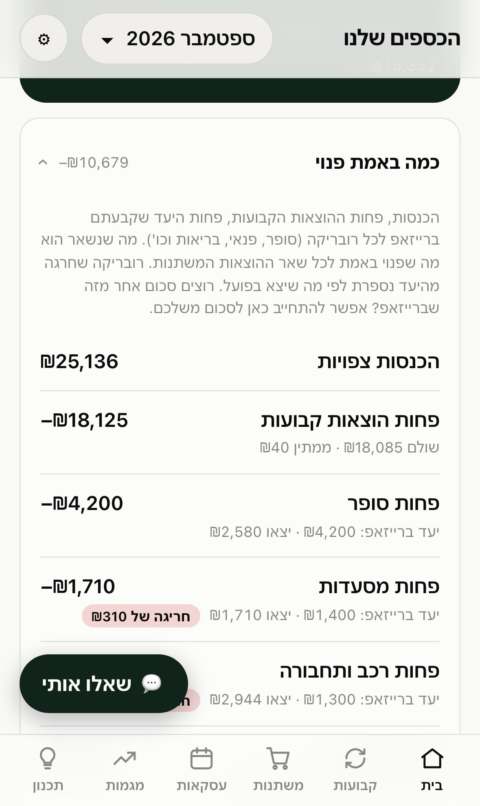
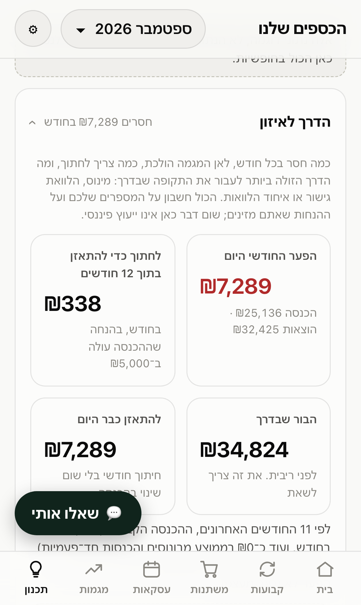
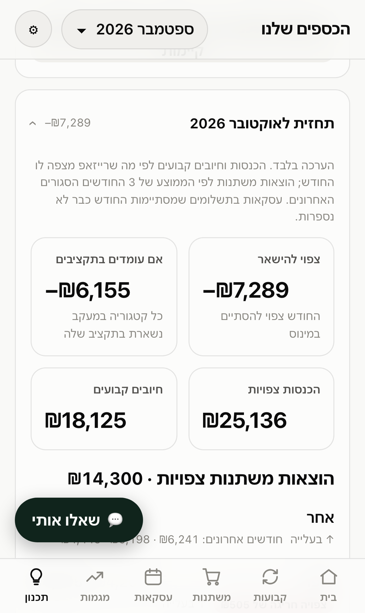

# Family Finance Hub

**Know where the month stands, ask before you spend, and plan the way out of the
minus.** A private, mobile-first finance hub for one household, built on top of
[RiseUp](https://www.riseup.co.il): it reads your cashflow through RiseUp's
official read-only MCP server, keeps its own copy, and adds what a budgeting app
does not do: a morning brief, an assistant that answers "can I buy this?", and a
planner that tells you how much has to change and what a loan would really cost.

Hebrew, right-to-left, on your own domain, open only to the two to four people
you list.

<p align="center">
  
  
  
  
</p>

<p align="center"><sub>Built-in sample data (<code>?demo=tight</code>: a household that spends more than it earns).</sub></p>

## Three things it does

### 1. See: the month, without the accounting

- **A brief every morning.** What went out yesterday, how much today allows,
  which rubrics went over their target, which fixed charges land this week, and
  where the month is heading. Your phone gets a notification that it is ready;
  the notification itself carries **no amounts and no names**. Those appear only
  after you tap and the hub opens behind its login.
- **What is really free.** Income, minus fixed charges, minus the target you set
  in RiseUp for each rubric (groceries, leisure, health). The last line is what
  is left for everything else. A rubric over its target counts at what was
  actually spent, so an overrun cannot hide.
- **Pending charges get a name.** RiseUp's API names a fixed charge only once it
  has been charged. Until then the hub infers the name from recent months by
  amount and expected day, says so when it is unsure, and flags a charge that has
  been "expected" for months and never came: probably cancelled, still eating
  your budget.
- **Next month, predicted.** Expected income, fixed charges and which installment
  plans end, and variable spending per category against its budget.
- **Plain language.** Every term has a `?`. Three text sizes. A table behind every
  chart. Fixed and variable stay apart exactly as RiseUp files them.

### 2. Ask: an assistant that checks before it answers

Runs on Claude, and answers only through tools over the same numbers the screens
show, so it cannot disagree with them or make a figure up.

- **"I want to spend ₪400 on a night out. Can I?"** It picks the rubric, says what
  is left there, and answers one of three ways: yes; yes, if ₪X moves from a
  rubric that is under budget (it does that only after you approve); or no, unless
  it really matters, with the least painful alternatives.
- **"How much did we spend on take-away this year?"**, "which fixed charges are
  worth renegotiating?", "what if I get a ₪40,000 bonus in January?"
- **"Should we take a ₪100,000 loan to get through the year?"** It runs the
  planner below and answers with costs, not opinions.

Budget it moves lives in the hub only, in an append-only log with an undo. RiseUp
itself is never written to.

### 3. Plan: the way out of the minus

For a household that spends more than it earns, **the path to balance** answers
the three questions that matter:

- **How big is the gap, and where is it heading?** The trend is fitted on
  *recurring* income, so a bonus a year ago does not read as "income is falling".
  It also shows how the gap is covered today: money coming in from outside the
  cashflow (savings, loans), which does not renew itself.
- **How much has to change?** The monthly cut that reaches balance by your target
  month, given the extra income you expect by then.
- **What is the cheapest way to carry the months in between?** Overdraft, a bridge
  loan, consolidating existing loans, or both, compared by total interest, lowest
  point, and the month from which you are balanced. When a plan does not hold, it
  says how much more per month is missing. It says plainly when a loan only buys
  time.

Plus a **what-if planner**: a bonus, a raise, a new expense, a loan that closes
installment plans, month by month, with a safe daily spend.

## Why it is built this way

- **Every number can be recomputed by hand.** The finance logic is pure, tested
  TypeScript with no model in the loop. The assistant explains; it never
  calculates.
- **Your arrangement survives.** Renames, moved transactions, hidden items, widget
  layout, commitments and budget shifts live in an overrides layer. A sync never
  overwrites them, and nothing is ever deleted.
- **Private by construction.** Cloudflare Access in front, and the API verifies
  the Access token and the email allowlist again by itself. The RiseUp token lives
  in SSM; CI can write it and cannot read it back. No analytics, no third-party
  scripts, a strict CSP.
- **Public code, private deployment.** Nothing that identifies a deployment is in
  this repository: account ids, domain, emails and resource names come from `.env`
  and from GitHub environment **secrets** (secrets, because the run logs of a
  public repository are public).
- **Cheap.** Serverless end to end, with a budget alarm at $5 a month.

## How it works

```
RiseUp ──(official MCP server, token scope budget:read)──> sync Lambda, twice a day
                                                                │
                                                                ▼
                                                        S3, one JSON per month
                                                          │             │
phone ──> Cloudflare Access ──> Cloudflare Pages ──/api──> API Lambda   │
          (email allowlist)     (UI + proxy function)      │  verifies the Access JWT
                                                           ▼            │
                                                   assistant Lambda     │
                                                   (Claude + tools)     │
                                                                        ▼
phone <──(Web Push: "the brief is ready", no figures)──────── brief Lambda, 07:30
```

The RiseUp token lives only in SSM; CI can write it and cannot read it back.
The API checks the Access token and the email allowlist itself, so the gate does
not depend on Cloudflare alone. Everything is serverless, and a budget alarm
is set at $5 a month.
The reasoning is in [docs/architecture.md](docs/architecture.md).

## Try it in two minutes

```bash
npm install
npm run dev      # http://localhost:5180, on sample data
                 # http://localhost:5180/?demo=tight for a household in the minus
npm test
```

No accounts needed. To see your own data locally, without any cloud, put a
RiseUp token in `.env` and follow "Local development" in
[docs/setup.md](docs/setup.md).

## Deploy your own

You need an AWS account, a domain on Cloudflare, and a RiseUp account.

1. `cp .env.example .env` and fill it in. In each stack under `infra/`, copy
   `example.tfvars` to `terraform.tfvars` (gitignored) and fill it in.
2. `scripts/bootstrap-state.sh`, then apply `infra/bootstrap` once from your
   laptop. It creates the role GitHub Actions assumes through OIDC, so no AWS
   keys are stored anywhere.
3. Put the same values in the GitHub `production` environment as **secrets**.
4. Push to `main`. The deploy workflow tests, applies Terraform and publishes.
5. Optional: an `ANTHROPIC_API_KEY` secret turns the assistant on, and a pair of
   `VAPID_*` secrets turns on the morning notification. Both are in the runbook.

Nothing that identifies a deployment is in this repository: account ids, domain,
emails and resource names come from `.env` and from environment secrets. They
are secrets rather than variables because the run logs of a public repository
are public. The full runbook is [docs/setup.md](docs/setup.md).

## Layout

| Path | What |
|------|------|
| `packages/core` | Pure, tested finance logic: month status, what is free, the daily brief, next month, purchase check, path to balance, what-if forecast, recommendations |
| `apps/web` | UI (Vite, React, ECharts) and the `/api` Pages Function |
| `services/backend` | Sync, API, assistant and brief Lambdas; local sync and local API |
| `infra` | Terraform: `bootstrap` (CI role), `aws`, `cloudflare` |
| `scripts` | Config, state bootstrap, deploy (shared by CI and laptop), `check.sh` |
| `docs` | [Architecture](docs/architecture.md), [dashboard spec](docs/dashboard.md), [setup](docs/setup.md), [roadmap](docs/roadmap.md) |

Run `scripts/check.sh` before every commit.

## Notes

This project is not affiliated with RiseUp. It uses their public, read-only MCP
server, `@riseup-oss/mcp`, with a personal token you create yourself. The
recommendations are rule-based and are not financial advice.

## License

[MIT](LICENSE)
